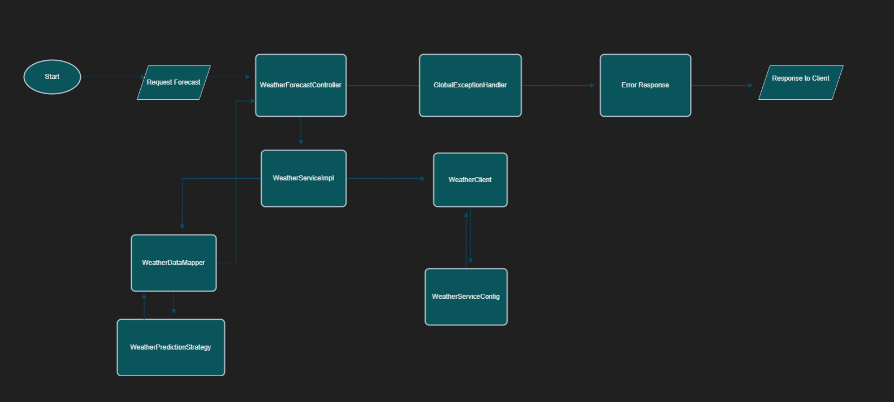

# Weather Forecast Project

Welcome to the Weather Prediction project! This application provides current weather prediction and a next 3-day weather forecast for any city worldwide using the OpenWeatherMap API.


##  Table Of Contents

- [Introduction](#introduction)
- [Features](#features)
- [API Reference](#api-reference)
- [Pre-Requisites](#pre-requisites)
- [Usage](#usage)
- [Flow Chart](#flow-chart)
- [Architectural Design](#architectural-design)
- [CI/CD Deployment](#jenkins)
- [Docker Configuration](#docker-configuration)
### Introduction

The Weather Forecast project is a simple and user-friendly application that fetches and displays weather data. It allows users to search for a city and view current weather prediction as well as a 3-day forecast. This project is built using Springboot and integrates with the OpenWeatherMap API to retrieve weather data.
## Features

- Search for weather by city name
- Show a 3-day weather forecast(high and low temperature of each day)
- Display current weather conditions based on temperature(Date, prediction)
## API Reference

This project uses the OpenWeatherMap API to retrieve weather data. Below are the key API endpoints used:

- **OpenWeatherMap Endpoint:**  
  - **HTTP Method:** GET
  - **Endpoint:** `http://api.openweathermap.org/data/2.5/weather?q={city name}&appid={API key}`

- **Project Endpoint:**  
  - **HTTP Method:** GET
  - **Endpoint:** `http://localhost:8080/forecast?city=london`

For detailed information on the OpenWeatherMap API, visit the official documentation.


## Pre-Requisites

You must have docker desktop installed and docker hub account to run this application on your system.

Official links for reference:
- [Docker Desktop](https://www.docker.com/products/docker-desktop)
- [Docker Hub](https://hub.docker.com/)
## Architectural Design Used

## SOLID Principles

We adhere to the SOLID principles to ensure our codebase is easy to manage, extend, and scale. Here’s how each principle is applied in this project:

### Single Responsibility Principle (SRP)

Every class in our application has a single responsibility or purpose. This makes our classes easier to understand, test, and maintain. For example:
- `ClientImpl` handles the communication with external APIs or services.
- `DataMapperImpl` is responsible for data mapping and transformation.
- `ServiceImpl` contains the business logic.
- `Controller` handles the incoming HTTP requests and responses.

### Open/Closed Principle (OCP)

Our classes are open for extension but closed for modification. By using the Strategy Pattern in the `Prediction` class, we can add new prediction strategies (like `DataMapperImpl` or `SimpleWeatherPredictionStrategy`) without modifying the existing `Prediction` class. This reduces the risk of introducing bugs.

### Liskov Substitution Principle (LSP)

We ensure that objects of a superclass can be replaced with objects of a subclass without affecting the correctness of the program. The different implementations of `WeatherPredictionStrategy` adhere to this principle by providing consistent behavior.

### Interface Segregation Principle (ISP)

We create specific interfaces for specific client needs rather than using one general-purpose interface. The `WeatherPredictionStrategy` interface ensures that implementing classes only need to be concerned with the `predictConditions` method relevant to them.

### Dependency Inversion Principle (DIP)

Our high-level modules do not depend on low-level modules. Both depend on abstractions. In our example, the `SimpleWeatherPredictionStrategy` class depends on the `WeatherPredictionStrategy` interface rather than concrete implementations, which makes our code more flexible and easier to change.

## Design Patterns

#### Explanation
```
In this project, we have implemented the Strategy Pattern in the `WeatherDataMapperImpl` class, particularly using the `WeatherPredictionStrategy` interface and its implementations (`DataMapperImpl` and `SimpleWeatherPredictionStrategy`). The Strategy Pattern defines a family of algorithms, encapsulates each one, and makes them interchangeable. This pattern allows the algorithm to vary independently from clients that use these algorithms.

#### Implementation

Here’s how we’ve applied the Strategy Pattern in our project:

```java
// WeatherPredictionStrategy Interface
public interface WeatherPredictionStrategy {
    List<PredictionData> predictConditions(List<TempData> weatherData, LocalDate targetDate);
}

// Implementation of WeatherPredictionStrategy using DataMapperImpl
@Service
public class DataMapperImpl implements WeatherPredictionStrategy {
    @Override
    public List<PredictionData> predictConditions(List<TempData> weatherData, LocalDate targetDate) {
        // Implementation for data mapping based prediction
    }
}

// Another implementation for example
@Service
public class SimpleWeatherPredictionStrategy implements WeatherPredictionStrategy {
    @Override
    public List<PredictionData> predictConditions(List<TempData> weatherData, LocalDate targetDate) {
        // Simple prediction logic
    }
}

// WeatherDataMapperImpl class using the Strategy Pattern
@Service
public class WeatherDataMapperImpl {
    private final WeatherPredictionStrategy predictionStrategy;

    @Autowired
    public WeatherDataMapperImpl(WeatherPredictionStrategy predictionStrategy) {
        this.predictionStrategy = predictionStrategy;
    }

    public ResponseEntity<ForecastResponse> mapToForecastResponse(WeatherResponse weatherResponse) {
        // Implementation details...
        forecastResponse.setCurrentDatePrediction(predictionStrategy.predictConditions(tempList, today));
        // More implementation details...
    }
}

```
### Why We Used It

By implementing the Strategy Pattern, we separated each prediction algorithm into its own class (DataMapperImpl, SimpleWeatherPredictionStrategy, etc.). This made the WeatherDataMapperImpl class more maintainable and allowed us to add new algorithms without modifying the existing code.

Usage
The WeatherDataMapperImpl class uses the WeatherPredictionStrategy interface to define the method that each prediction strategy must implement. This allows the WeatherDataMapperImpl class to switch between different algorithms at runtime by setting a new strategy:
```
```
## Flow Chart


## Security Measures

This application utilizes Docker Secret to securely store the API key required for accessing external services. Docker Secret ensures that sensitive information, such as API keys, are encrypted and only accessible to authorized containers.
## Deploymet Automation - Jenkins Pipeline

The Jenkinsfile is used for defining the pipeline configuration for Continuous Integration/Continuous Deployment (CI/CD) in Jenkins. It defines the stages and steps required to build, test, and deploy the application automatically.

For example, our Jenkinsfile includes stages for:
- Building the application
- Running unit tests
- Building Docker images
- Pushing Docker images to a Docker registry

# CI/CD Pipeline Setup with Jenkins

## Prerequisites

- **Jenkins:** Make sure Jenkins is installed and running on your system.
- **JDK 11:** Ensure JDK 11 is installed.
- Setup the jenkins on **9090** port by changing the file httpPort given in folder structure

### Jenkins Configuration

1. **Install Jenkins:**
   - Download and install Jenkins from the [official Jenkins website](https://www.jenkins.io/download/).

   ``` install jenkins as local system and change the port to 9090 by following the jenkins path file jenkins.xml, **httpport**```

2. **Install JDK 11:**
   - Download and install JDK 11 from the [Oracle JDK website](https://www.oracle.com/java/technologies/javase-jdk11-downloads.html).

### Create a New Pipeline

1. Open Jenkins and create a new pipeline:
   - Go to **New Item**.
   - Enter the name of the item.
   - Select **Pipeline**.
   - Click **OK**.

2. Configure the pipeline:
   - Select the pipeline you created.
   - Go to the **Configure** section.
   - Provide the Git repository URL.
   - Select **GitHub hook trigger for GITScm polling**.
   - Enable **Poll SCM** and provide the cron schedule (`*****` for every minute).

3. Set up the pipeline script from SCM:
   - Under **Pipeline**, select **Pipeline script from SCM**.
   - Set **SCM** to **Git**.
   - Enter the repository URL.
   - Set **Credentials** to **None**.
   - Set the branch to `main`.
   - Set **Script Path** to `Jenkinsfile`.
   - Click **Save**.

4. Configure credentials for Docker:
   - In the **Pipeline** configuration, select **Pipeline Syntax**.
   - Type **withCredentials** under **Sample Step**.
   - Click **Add** under Bindings and select **Secret text**.
   - Provide the variable name (e.g., `hubpassword`).
   - Under Credentials select Add -> Jenkins
   - Select **secret text** under Kind, provide docker password    under Secret and provide `dockerimagehubpsw`under ID
   - select `dockerimagehubpsw` under credentials
   - Save and close.

### Jenkins Tools Configuration

1. **Maven Installation:**
   - Go to **Manage Jenkins** > **Global Tool Configuration**.
   - Under **Maven**, click **Add Maven**.
   - Name: `maven_3.9.6`.
   - Check **Install automatically**.
   - Select version `3.9.6`.

2. **JDK Installation:**
   - Under **JDK**, click **Add JDK**.
   - Name: `JDK11`.
   - Uncheck **Install automatically**.
   - Provide the JDK installation path.

   Click **Apply** and **Save**.

## Jenkins Pipeline Script Example

Below is an example of a Jenkinsfile that includes setting up Docker credentials:

```groovy
pipeline {
    agent any

    environment {
        DOCKER_CREDENTIALS_ID = 'docker_password'
    }

    stages {
        stage('Checkout') {
            steps {
                git branch: 'main', url: 'https://github.com/your-repo/your-project.git'
            }
        }

        stage('Build') {
            steps {
                sh 'mvn clean package'
            }
        }

        stage('Docker Build and Push') {
            steps {
                withCredentials([string(credentialsId: DOCKER_CREDENTIALS_ID, variable: 'DOCKER_PASSWORD')]) {
                    sh 'docker login -u your-username -p $DOCKER_PASSWORD'
                    sh 'docker build -t your-image-name .'
                    sh 'docker push your-image-name'
                }
            }
        }
    }

    post {
        success {
            echo 'Build and push succeeded!'
        }
        failure {
            echo 'Build or push failed!'
        }
    }
}
```
## Docker Configuration

The Dockerfile is used to build Docker images for the application. It specifies the environment and dependencies required to run the application within a Docker container. It typically includes instructions for copying application code into the image, installing dependencies, and exposing ports.

Our Dockerfile includes:
- Base image selection
 ```
        FROM openjdk:8
 ```
- Port exposure
 ```
        EXPOSE 8080
 ```       
- Application code copying
```
    ADD target/weather-forecast-devops.jar weather-forecast-devops.jar
```
- Environment variable configuration
```
    ENV MY_API_KEY=/run/secrets/Api-Key
```
- Command to start the application within the container
```
    ENTRYPOINT ["java","-jar","/weather-forecast-devops.jar"]
```
## Usage

Please note the docker image is build specifically for Windows.

 - **Docker Pull**
    ```
    docker pull soophia/weather-forecast-devops:latest
    ```
 - **Manually Start the Docker Container through Docker Desktop**
    ```
    Run the Image avaible under Container section of Docker Desktop
    ```
 - **Check the Docker container running**
    ```
      docker ps -a
    ```
 - **Check Docker Environment Variable:**
    ```
    docker exec -it <container_id> bash
    env
    ```
 - **Initialize Docker Swarm:**
    ```
    docker swarm init
    ```
 - **Create Secret Key:**
    ```
    echo original_key | docker secret create Api-Key -
    ```
 - **Create Docker Secret Service:**

     ```
    docker service create --name forecast-service --secret Api-Key -e MY_API_KEY=/run/secrets/Api-Key -p 8080:8093 soophia/weather-forecast-devops:latest
    ```

 - **Swagger URL**
   ```
    http://localhost:8080/swagger-ui/index.html#/weather-forecast-controller/
   ```


## Authors

- [@SophiaIncode](https://github.com/SophiaIncode/weather-forecast-service)

